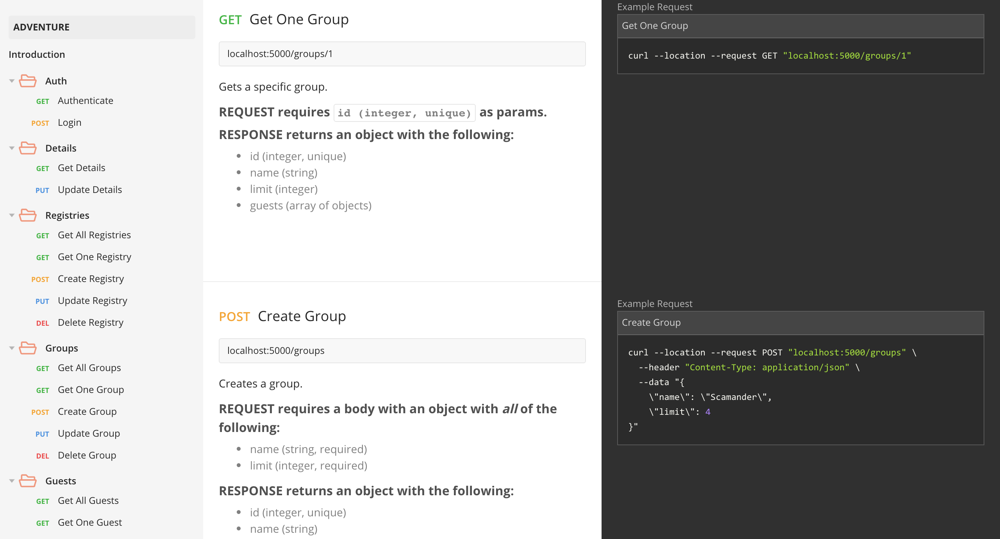
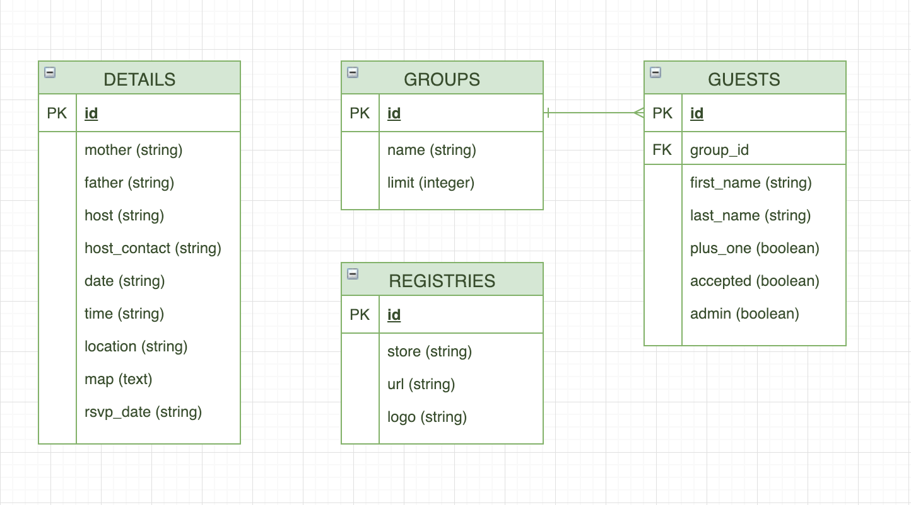

# The Adventure Begins

Back-end for https://github.com/vikandagonzales/adventure.

## API Documentation
All back-end API routes have been documented on [Postman](https://documenter.getpostman.com/view/5952215/RznEMKFu).


## ERD


## Installation

#### Repository Setup
```
$ git clone https://github.com/vikandagonzales/adventure-backend
$ cd adventure-backend
$ npm install
```

#### Token Setup
- Add your own `.env` file with a `SECRET` environment, using the file `.env.example` as an example.

#### Database Setup

- Make sure you have PostgreSQL installed.
- Create a database on your local called `adventure-dev`.
- In the repo, create a `seeds` folder within the `db` directory and add your own seed files, using the `seeds.example` folder as an example.
```
$ npm run reboot
```

## Copyright

Copyright &copy; 2019 Vikanda Gonzales.